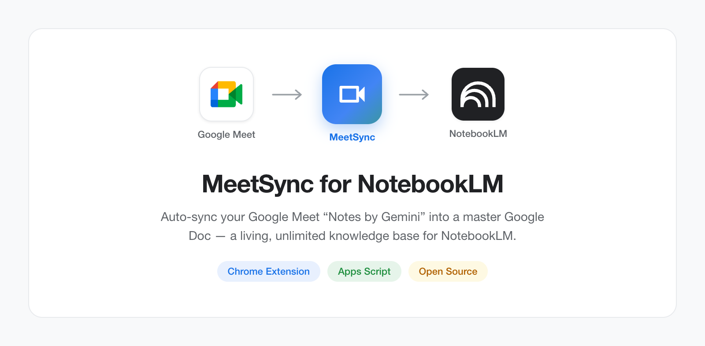

<p align="center">
  

# MeetSync

Automatically consolidate all your **Google Meet notes** into a single **Master Google Doc** — a living, unlimited knowledge base for NotebookLM or any other AI tool.

---

## 🚀 Quick Start (One-Click Install)

The easiest way to use this tool is to copy the pre-configured template:

1. **[Click here to Make a Copy of the Template](https://docs.google.com/document/d/1ptU9lzwjX2LfBi_IVZeT00YCLrkmm5D25KmqeqEwB_o/copy)**
2. In your new document, refresh the page.
3. A new **🚀 NotebookLM** menu will appear.
4. Run **🔄 Sync Now** and follow the authorization prompts.

> ### 🔧 Recreating the template (if the link above ever breaks)
>
> 1. Create a **new empty Google Doc** at [docs.google.com/document/create](https://docs.google.com/document/create)
> 2. Open **Extensions > Apps Script**, delete the default code, and paste the entire content of [`apps-script/Code.gs`](apps-script/Code.gs)
> 3. Name the project **"Sync NotebookLM"** and click **Save**
> 4. In the Apps Script editor, add the **Drive API** (v3) and **Docs API** (v1) via the **Services** panel (+)
> 5. Click **Deploy > New deployment > Web app**:
>    - Execute as: **Me**
>    - Who has access: **Anyone**
> 6. Copy the resulting **deployment URL** (`https://script.google.com/macros/s/{id}/exec`)
> 7. Update the link in this README (line 14 above) with the new **doc URL** + `/copy` at the end

---

## Install from Releases

1. Go to the **[Releases page](https://github.com/benoit-prentout/meetsync/releases)**
2. Download the latest `meet-gemini-notebooklm.zip`
3. Unzip it somewhere on your machine
4. Open Chrome to `chrome://extensions`
5. Enable **Developer mode** (toggle in the top-right corner)
6. Click **Load unpacked** and select the unzipped folder
7. Complete the setup wizard with your deployment URL and script project ID

### First-time setup (one per user)

1. **Create OAuth credentials** — follow [Google Cloud Setup](docs/google-cloud-setup.md)
2. **Deploy the Apps Script backend** — copy `apps-script/Code.gs` into an Apps Script project bound to your master Google Doc, enable Drive + Docs APIs, and deploy as a web app. Or use the **Deploy Backend** button in extension Settings for auto-deploy.
3. **Enter your deployment URL** and **script project ID** in the extension's setup wizard.

---

## 🏗 Why this tool?

NotebookLM limits its sources to 50. By grouping months of meetings into a single document, you enable any AI tool to make long-term connections without ever hitting source limits.

### ✨ Features

* 👥 **Team Support**: Fetches meeting notes organized by your colleagues (files in "Shared with me", "Shared Drives", or files containing "Notes par Gemini").
* 📊 **Summary Table**: An automatically generated table at the top of your document lists all synced meetings.
* 📦 **Auto-Archiving**: Automatic archives are created monthly or when the document size reaches the limit.
* 📧 **Email Notifications**: Receive an email with the link to your new archive as soon as it is created.
* 🛡️ **Smart Sync**: Works even on files where you only have view-only access.
* ⚡ **Performance**: Uses advanced Google APIs to process 20+ meetings in seconds.
* 🔄 **Backend Auto-Deploy**: Push Code.gs updates directly from the extension Settings via the Apps Script REST API — no manual copy-paste needed.
* 📈 **Analytics Dashboard**: Multi-section insights dashboard with charts showing sync frequency, files processed, doc growth rate, success rates, and sync streaks.
* 🗃️ **Archive History**: Full history of archive events tracked and visible in the Analytics view.

---

## 🏗 How it works?

1. **Global Scan**: The script searches for Gemini note variants ("Notes de la réunion", "Meeting notes", etc.) everywhere on your Drive.
2. **Filtering**: It ignores already-synced files using an internal script database.
3. **Cleaning**: It extracts text, removes Gemini-specific metadata, and simplifies Markdown formatting.
4. **Insertion**: It adds new notes to the top of the doc and updates the summary table.
5. **Archiving**: Monthly or when full, it creates a **"Meeting Notes Archive"** and resets the master doc.

---

## 🛠 Setup Guide (Manual Install)

### 1️⃣ Prepare the Master Document
1. Create a new, empty **Google Doc** (e.g., "Master - Meeting Notes").
2. Inside this doc, go to the menu **Extensions > Apps Script**.

### 2️⃣ Copy the Code
Choose one:

**Option A — Auto-Deploy (recommended)**: Complete the Chrome extension Setup wizard, then in Settings click **Deploy Backend**. The extension pushes the code via the Apps Script API — no manual copy-paste needed.

**Option B — Manual copy**:
1. Delete everything in the script editor.
2. Copy the entire content of `apps-script/Code.gs` and paste it into the editor.
3. Save and name the project "Sync NotebookLM".

### 3️⃣ Configure Google Services
The script needs direct access to Drive and Docs APIs.
1. In Apps Script editor, click the **+** next to **Services**.
2. Search for **Google Drive API** (v3) and click **Add**.
3. Click the **+** again, search for **Google Docs API** (v1) and click **Add**.

### 4️⃣ First Run & Authorization
1. In the top toolbar, ensure `appendMeetNotesToMaster` is selected and click **Run**.
2. An authorization window will appear: follow the prompts to **Allow** the script.
3. Go back to your Google Doc and refresh the page. A new **🚀 NotebookLM** menu will appear!

### 5️⃣ Automation (Easiest Method)
To have the sync run automatically every 15 minutes:
1. In your Google Doc, go to the menu **🚀 NotebookLM > ⏰ Enable Auto-Sync**.
2. That's it! The script will now run in the background.

---

## 📋 Daily Usage

| Option | Description |
|---|---|
| **🔄 Sync Now** | Forces an immediate sync of the latest meetings. |
| **⏰ Enable Auto-Sync** | Activates the 15-minute background synchronization. |
| **📜 View Sync History** | Displays a log of recent synchronization runs. |
| **📦 Archive Document Now** | Manually empty the master doc and create a timestamped archive. |
| **🧹 Reset Sync State** | Useful if you want to re-import everything from scratch. |
| **❓ Start Here / Help** | Shows instructions and quick tips. |

---

## 🧠 Connecting to NotebookLM

1. Go to [NotebookLM](https://notebooklm.google.com).
2. Create a new Notebook.
3. Add your **Master Google Doc** as a source.
4. **Important**: Every time you use NotebookLM, click the **Refresh** button next to the Google Doc source so it picks up the latest meetings.
5. **Archives**: When an archive is created, don't forget to add the archive file as a source in NotebookLM to keep your full history!

---

## 💻 Development

```bash
npm run dev       # Vite dev server at localhost:5173 (chrome APIs mocked)
npm run build     # tsc + vite build → dist/
npm test          # vitest run
npm run package   # build + zip → meet-gemini-notebooklm.zip
```

Dev entry points (bypass `chrome-extension://` restrictions):

| URL | Renders |
|-----|---------|
| `/dashboard.html` | Full auth + dashboard flow (conditional mock) |
| `/dashboard-dev.html` | `<Dashboard />` directly, mocked data |
| `/popup-dev.html` | `<Popup />` directly, mocked data |
| `/wizard-dev.html` | `<SetupWizard />` with scenario picker |

Mocks live in `src/dev-mocks.ts`. Tree-shaken from production builds.

---

## 📜 License
MIT
